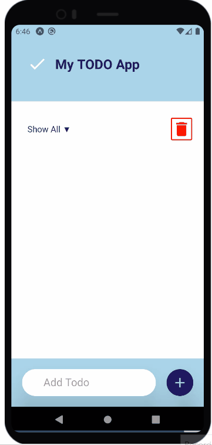

# My TODO App

My TODO App is a task management application to help users stay organized and keep daily tasks in one place. The app is a simple mobile application created with React Native.

## Features
Myt TODO App features include:  
• Create tasks 
• Create a list of all tasks 
• Delete a task 
• Delete all tasks 
• Mark task as done 
• Mark task as undone 
• Show a list of all tasks 
• Show a list of undone tasks 
• Show a list of done tasks 
 
Local Storage 
Created tasks are stored to AsyncStorage, which saves data 
persistently in the device. 

 

## Design
The My TODO App design is simple and minimalistic. The interface is light and airy and it includes only necessary elements. Functional options have icon buttons with different colors, what makes them to be found easily. Color theme of the app is designed to be harmonious, ensure accessible text, and distinguish UI elements and 
surfaces from one another.
